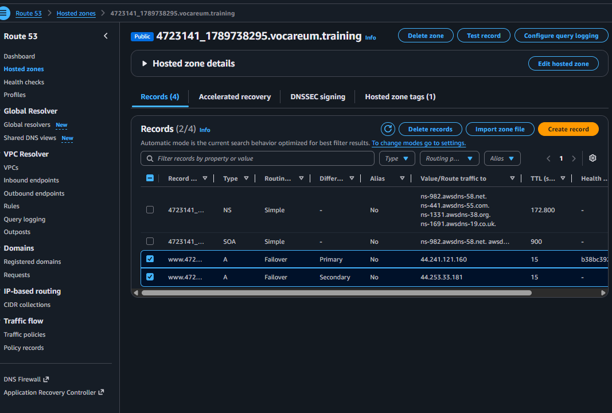
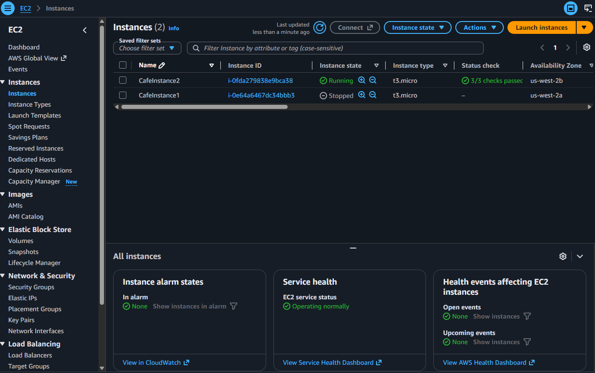
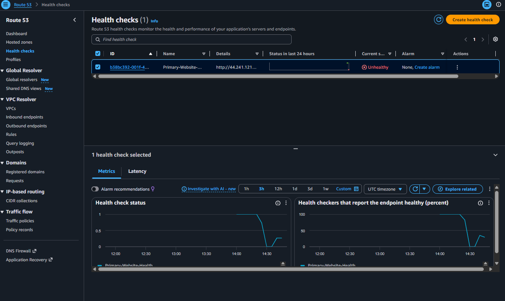
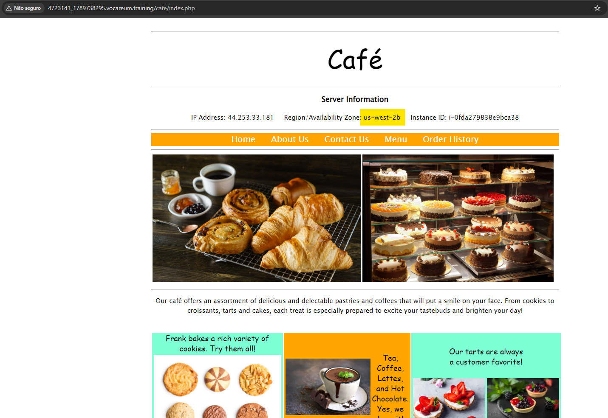

# AWS Route 53 - Arquitetura de Alta Disponibilidade e Failover DNS

## 📌 Visão Geral do Projeto

Este projeto demonstra a implementação de uma arquitetura resiliente e tolerante a falhas na **AWS** utilizando o **Amazon Route 53** com política de roteamento por **Failover**. 

O objetivo principal é garantir a disponibilidade contínua de uma aplicação web (Café Application) distribuída em duas Zonas de Disponibilidade (AZs) distintas na região `us-west-2`. Caso o servidor principal fique indisponível, o tráfego é redirecionado automaticamente para o servidor de backup sem intervenção manual.

## 🏗️ Arquitetura da Solução

1. **Servidor Principal (Primary):** Instância EC2 (`CafeInstance1`) rodando na AZ `us-west-2a`.
2. **Servidor Secundário (Secondary/Standby):** Instância EC2 (`CafeInstance2`) rodando na AZ `us-west-2b`.
3. **Route 53 Health Check:** Monitora a saúde do endpoint HTTP principal a cada 10 segundos.
4. **Alarme CloudWatch & SNS:** Envia notificações por e-mail imediatamente quando a falha é detectada.
5. **DNS Failover Routing:** Registros de DNS tipo A configurados para redirecionar o nome de domínio para a instância secundária se a principal falhar.

---

## 🛠️ Serviços Utilizados

* **Amazon Route 53:** Gestão de DNS, Hosted Zones, Roteamento por Failover e Health Checks.
* **Amazon EC2:** Servidores web rodando a stack LAMP.
* **Amazon CloudWatch:** Monitoramento de métricas do Health Check e disparo de alarmes.
* **Amazon SNS (Simple Notification Service):** Envio de alertas de e-mail sobre a alteração do estado de saúde da aplicação.

---

## 📸 Evidências de Implementação e Funcionamento

### 1. Configuração dos Registros DNS no Route 53
Registros tipo A configurados com política de roteamento por Failover apontando para as instâncias primária e secundária.

### 2. Simulação de Falha na Instância Principal
Parada manual da `CafeInstance1` no console EC2 para simular uma queda de servidor.

### 3. Detecção Automática pelo Health Check
O Route 53 detecta a falha do endpoint HTTP e altera o status para **Unhealthy**, disparando a notificação via Amazon SNS.

### 4. Redirecionamento de Tráfego com Sucesso (Failover)
Ao acessar a URL do domínio, a aplicação continua no ar, sendo servida automaticamente pela `CafeInstance2` localizada na AZ `us-west-2b`.

---

## 🚀 Aprendizados e Habilidades Demonstradas

* Configuração de estratégias de Disaster Recovery (DR) baseadas em DNS.
* Criação e personalização de Health Checks de baixa latência no Route 53.
* Automação de alertas operacionais utilizando CloudWatch e SNS.
* Validação prática de Alta Disponibilidade (HA) e Redundância Multi-AZ.
